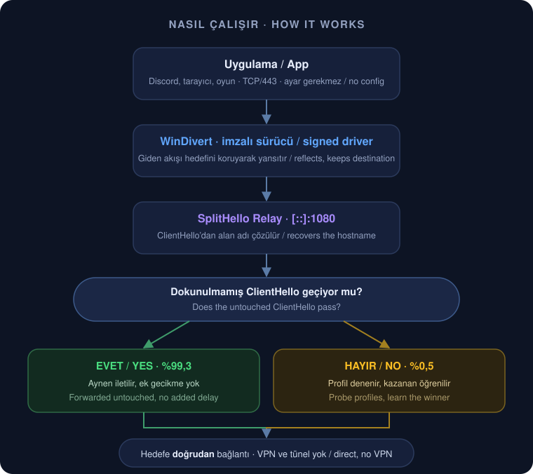
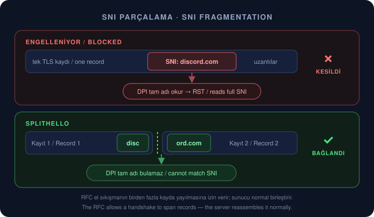
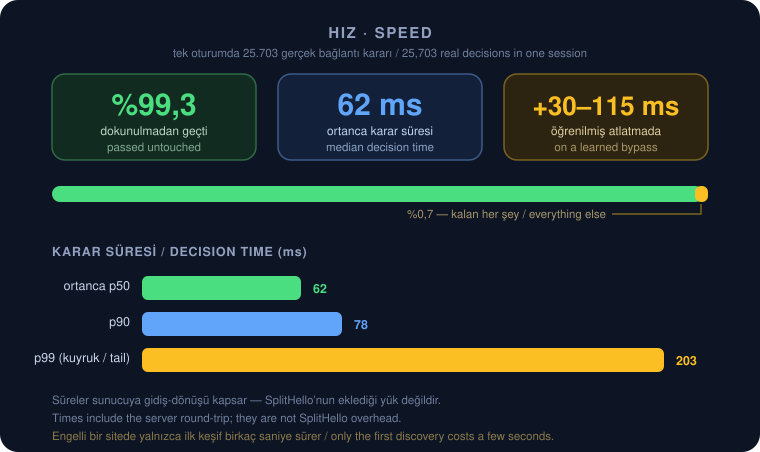
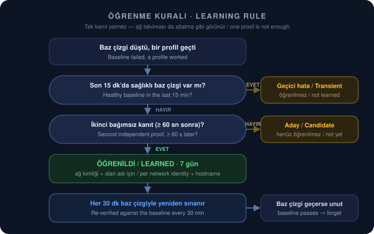

# SplitHello

**TR** — Windows için VPN'siz DPI teşhis ve atlatma aracı. Her ağ ve alan adı için işe yarayan **en az müdahaleci** yöntemi kendi öğrenir; zaten çalışan trafiğe hiç dokunmaz.

**EN** — VPN-free DPI diagnosis and bypass for Windows. It learns the **least invasive** method that works per network and hostname, and leaves already-working traffic untouched.

---

## Ne işe yarar? / What it does

**TR** — Türkiye'deki operatörler siteleri iki yolla engeller:

1. **DNS zehirlenmesi** — engelli alan adı için sahte IP döner.
2. **SNI denetimi** — DPI kutusu TLS ClientHello içindeki alan adını okur ve bağlantıyı keser.

SplitHello ikisini de VPN ya da veri yolunda uzak sunucu olmadan çözer.

**EN** — Turkish ISPs block sites two ways: DNS poisoning (fake IPs) and SNI inspection (DPI reads the hostname inside the TLS ClientHello). SplitHello handles both with no VPN and no remote relay on the data path.

---

## Nasıl çalışır? / How it works

<p align="center">
  
</p>

**TR** — Akış özeti: WinDivert giden 443 trafiğini yerel relay'e yansıtır, relay ClientHello'dan alan adını çıkarır, önce **hiç dokunmadan** dener. Geçerse iş biter. Geçmezse sınırlı bir profil kümesini dener ve çalışanı o ağ + alan adı için hatırlar.

**EN** — WinDivert reflects outbound 443 into the local relay. The relay recovers the hostname, tries the **untouched** ClientHello first, and only probes profiles if that fails. The winner is remembered per network + hostname.

---

## SNI parçalama / SNI fragmentation

**TR** — En çok işe yarayan aile, tek bir ClientHello'yu **geçerli birden fazla TLS kaydına** bölerek alan adını ikiye ayırır:

<p align="center">
  
</p>

**TR** — Bu standart dışı bir hile değil: RFC, el sıkışma mesajlarının birden fazla kayda yayılmasına izin verir. Sunucu normal birleştirir; aynı birleştirmeyi yapmayan DPI alan adını göremez.

**EN** — Not a protocol violation: the RFC allows handshake messages to span records. The server reassembles normally; DPI that doesn't, fails to read the SNI.

---

## Hız farkı var mı? / Is there a speed cost?

**TR — Kısa cevap: normal sitelerde yok.** Aşağıdaki sayılar geliştirme makinesinde tek oturumda ölçülen **25.703 gerçek bağlantı** kararından geliyor.

**EN — Short answer: none for normal sites.** Numbers below come from **25,703 real connection** decisions measured in one session.

<p align="center">
  
</p>

| | TR | EN | Ölçüm / Measured |
|---|---|---|---|
| **Normal site** | Hiç dokunulmaz, ek gecikme yok | Passed untouched, no added delay | ortanca **62 ms** / median 62 ms |
| **Yoğun kuyruk** | Yavaş sunucular dahil | Including slow origins | p90 **78 ms** · p99 **203 ms** |
| **Öğrenilmiş engelli site** | Hatırlanan profil ilk denenir | Learned profile tried first | **+30–115 ms** |
| **İlk keşif (engelli)** | Profiller taranırken bir kez | One-off while probing | **birkaç saniye / a few seconds** |

**TR** — Bağlantıların **%99,3'ü** hiç değiştirilmeden geçti; yalnızca **%0,5'i** herhangi bir profile ihtiyaç duydu. "Karar süresi" sunucuya gidiş-dönüşü de kapsar, yani bu sayılar SplitHello'nun eklediği yük değil, toplam el sıkışma süresidir. Oyun ve ses trafiği (443 dışı) hiç dokunulmadan geçer; UDP/443 varsayılan olarak serbesttir, böylece YouTube gibi HTTP/3 servisleri kendi hızlı yolunda kalır.

**EN** — **99.3%** of connections passed unmodified; only **0.5%** needed any profile. "Decision time" includes the server round-trip, so these are total handshake times, not SplitHello overhead. Non-443 game/voice traffic is never touched, and UDP/443 passes by default so HTTP/3 services keep their native fast path.

---

## Öğrenme mantığı / Learning logic

**TR** — Tek bir başarısızlık kanıt sayılmaz. Ağ takılmaları baz çizgiyi de denenen profili de düşürür ve bu, başarılı bir atlatma gibi görünür. Bu yüzden öğrenme **iki bağımsız kanıt** ister.

**EN** — One failure is not evidence. A network hiccup fails the baseline *and* the profile tried during it, which looks exactly like a successful bypass. Learning therefore requires **two independent confirmations**.

<p align="center">
  
</p>

**TR** — Öğrenilen kayıtlar Windows ağ kimliğine göre ayrılır (evdeki kural mobil hotspot'ta kullanılmaz), 7 gün sonra düşer ve **30 dakikada bir** dokunulmamış baz çizgiye karşı yeniden sınanır. Baz çizgi tekrar geçerse kayıt hemen silinir; böylece yanlış bir öğrenme en geç bir saat içinde kendini düzeltir.

**EN** — Learned entries are scoped to the Windows network identity, expire after 7 days, and are **re-verified every 30 minutes** against the untouched baseline. If the baseline passes again the entry is dropped at once, so a false positive corrects itself within the hour.

---

## Mimari / Architecture

**TR** — Veri yolunda VPN, tünel ya da uzak sunucu yok; hedefe doğrudan bağlanılır. Cloudflare Worker normalde **yalnızca DNS** için kullanılır. Her bağlantıya tek bir iş parçacığı bakar, eşzamanlı bağlantı 1.024 ile sınırlıdır, 10 dakika veri akmayan bağlantı kapanır ve kapanışta tüm bağlantılar iptal edilip iş parçacıkları beklenir.

**EN** — No VPN, tunnel or remote server on the data path. The Worker normally serves **DNS only**. One owned thread per connection, capped at 1,024 live connections, idle flows closed after 10 minutes, and shutdown aborts every connection and joins its thread.

---

## DNS

**TR** — UDP/53 şeffaf yakalanır. A/AAAA sorguları ortak bir çift yığın önbelleği besler; diğer sorgu tipleri özgün mesajı bozmadan kimlik doğrulamalı Worker üzerinden gider. HTTPS/SVCB (tip 65), ECH ayarları ve DNS hata kodları uygulamaya olduğu gibi ulaşır.

**EN** — UDP/53 is captured transparently. A/AAAA warms a shared dual-stack cache; other query types pass through an authenticated Worker with the original wire message intact. HTTPS/SVCB (type 65), ECH config and DNS error codes reach the app unchanged.

---

## Kurulum / Setup

**Gereksinimler / Requirements:** Windows 10/11 · CMake 3.20+ · Visual Studio (C++ workload) · Node.js 20+ · ücretsiz Cloudflare hesabı / free Cloudflare account · yönetici yetkisi / admin rights

```bash
cmake -B build -S .
cmake --build build --config Release
ctest --test-dir build -C Release
```

```bash
build\Release\splithello.exe --setup   # Cloudflare OAuth + Worker deploy
build\Release\splithello.exe           # normal çalıştırma / normal run
```

**TR** — `--setup` tarayıcıda Cloudflare oturumu açar, rastgele bir paylaşılan sır üretir, Worker'ı yayınlar ve sırrı DPAPI ile şifreleyip saklar. Normal çalıştırmada bir UAC istemi çıkar ve uygulama sistem tepsisine yerleşir; ikonuna çift tıklamak tanılama panelini açar.

**EN** — `--setup` runs the Cloudflare OAuth flow, generates a shared secret, deploys the Worker and stores the secret encrypted with DPAPI. A normal run shows one UAC prompt and lives in the tray; double-click opens the diagnostics dashboard.

<details>
<summary><b>Seçenekler / Options</b></summary>

```
--setup              Cloudflare hesabını bağla ve Worker deploy et
--redeploy           Worker kodunu güncelle, gizli anahtarı yenile
--worker <url>       Worker URL'sini elle belirt
--port <port>        Relay portu (varsayılan: 1080)
--split-delay <ms>   TLS kayıt parçaları arası bekleme (varsayılan: 20)
--strategy <ad>      Tanılama: profili sabitle, öğrenmeyi kapat
--tunnel-fallback    Tüm profiller başarısızsa Worker tünelini kullan
--manual-proxy       WinDivert'sız, SOCKS5/CONNECT dinle
--quic-mode <mod>    allow (varsayılan), adaptive veya block
--include-process <desen>  Yalnız eşleşen exe'leri işle (tekrarlanabilir)
--exclude-process <desen>  Eşleşen exe'leri atla (tekrarlanabilir)
--restore-proxy      Çökme sonrası kalan proxy yedeğini geri yükle
--forget-strategies  Öğrenilen alan adı profillerini sıfırla
--list-strategies    Profilleri listele
--console            Tepsi yerine konsolda çalıştır
--verbose            Konsolda ayrıntılı log
```
</details>

<details>
<summary><b>Süreç kapsamı / Process scope</b></summary>

**TR** — Hangi uygulamaların kapsanacağı sınırlanabilir. Dışlama kuralları her zaman kazanır; dahil etme listesi doluysa eşleşmeyen süreçler normal Windows yolunda kalır.

```json
{
  "process_include": ["chrome.exe", "firefox*.exe"],
  "process_exclude": ["steam*.exe", "C:\\Games\\Legacy\\*"]
}
```
</details>

---

## Profiller / Profiles

| Profil | Ne yapar / What it does |
|---|---|
| `none` | Dokunulmamış ClientHello — baz çizgi / untouched baseline |
| `sni-mid` | Alan adının ortasından böler / cut mid-hostname |
| `record-1` | İlk bayttan sonra böler / cut after first byte |
| `packet-reverse` | TCP parçalarını ters sırada gönderir / reversed segments |
| `packet-ipfrag` | IPv4 paketini böler / IPv4 fragmentation |
| `packet-fake-*` | Sahte kapak ClientHello (bad seq / checksum) |
| `packet-autottl` | Kapak paketi sunucudan önce ölür / expires before server |
| `sni-pre`, `sni-multi`, `sni-mid-slow` | Farklı kesim noktaları / other cut points |

**TR** — Bir profil yalnızca **eksiksiz bir ServerHello** geldiyse "çalıştı" sayılır. TLS Alert, engel sayfası, yarım kayıt, sessiz düşüş ve RST ayrı teşhis sinyalleridir.

**EN** — A profile only "worked" after a **complete ServerHello**. Alerts, block pages, partial records, silent drops and RST are separate diagnostic signals.

---

## GoodbyeDPI'dan farkı / vs GoodbyeDPI

| | GoodbyeDPI | SplitHello |
|---|---|---|
| **Yöntem / Method** | Sabit paket hileleri / fixed packet tricks | Farksal baz çizgi + öğrenen profil kümesi / differential baseline + learned profiles |
| **DNS** | Ele almaz / not handled | Şeffaf, kimlik doğrulamalı DoH |
| **Kapsam / Scope** | Filtreye bağlı / filter-dependent | Tüm TCP/443; UDP/443 serbest / untouched |
| **Oyun etkisi / Gaming** | Geniş trafiği etkileyebilir | 443 dışı trafik hiç dokunulmaz / untouched |
| **Kanıt / Evidence** | Yok / none | Yerel SQLite teşhis kaydı + panel |

---

## Güvenlik / Security

- **TR** Worker uç noktaları `Bearer` sır ister; sır olmadan Worker kapalı çalışır (açık DNS proxy'ye dönüşmez). **EN** Worker endpoints require a bearer secret and fail closed.
- **TR** Relay yalnızca WinDivert'in SYN kaydında gördüğü bağlantıyı kabul eder — açık proxy değildir. **EN** The relay only accepts connections present in the short-lived SYN registry.
- **TR** Cloudflare oturumu Wrangler keyring'inde durur; SplitHello okumaz. Worker sırrı DPAPI ile şifrelenir. **EN** OAuth stays in Wrangler's keyring; the Worker secret is DPAPI-encrypted.
- **TR** WinDivert 2.2.2 sabit SHA-256 ile indirilir; uyuşmazlık derlemeyi durdurur. **EN** WinDivert is pinned by SHA-256; a mismatch fails configure.
- **TR** Ağ yolu fail-open: sürücü ya da relay ölürse filtre kalkar, internet normale döner. **EN** Fail-open: if the driver or relay dies, the filter is removed and traffic returns to normal.
- **TR** Telemetri yalnızca yereldir, hiçbir zaman yüklenmez. **EN** Telemetry is local only and never uploaded.

---

## Teknik özet / Technical summary

- **Dil / Language:** C++20 · spdlog + SQLite + WinDivert 2.2.2 (otomatik indirilir / auto-fetched)
- **Giriş / Ingress:** WinDivert TCP/443 (IPv4 + IPv6); UDP/443 varsayılan serbest / passthrough
- **Yedek yol / Fallback:** `--manual-proxy` ile SOCKS5 + HTTP CONNECT
- **Dosyalar / Files:** `%APPDATA%\splithello\` → `config.json` · `strategies.json` (1.000 kayıt, 7 gün) · `telemetry.db` (30 gün) · `splithello.log` (512 KiB × 3)
- **Testler / Tests:** `ctest --test-dir build -C Release` — TLS ayrıştırma, teşhis sınıflandırması, profil planlama ve yeniden doğrulama, telemetri şema geçişi, süreç kuralları, şeffaf yönlendirme ve bağlantı yaşam döngüsü (pompa, sınır, boşta zaman aşımı, kapanışta bekleme)

### Fuzzing

```bash
cmake -S fuzz -B build-fuzz -G Ninja -DCMAKE_BUILD_TYPE=RelWithDebInfo -DCMAKE_CXX_COMPILER=clang++
cmake --build build-fuzz --parallel
./build-fuzz/fuzz_tls -max_total_time=60 -dict=fuzz/tls.dict
```

**TR** — `fuzz/` derlemesi üç güvenilmez girdi yüzeyini hedefler: TLS kayıtları, DNS mesajları ve JSON. CI her push'ta Windows Release testlerini ve bir ASan fuzz smoke işini çalıştırır.

**EN** — The `fuzz/` build targets the three untrusted-input surfaces: TLS records, DNS messages and JSON. CI runs Windows Release tests plus an ASan fuzz smoke job on every push.

---

## Henüz yok / Not yet

- İmzalı sürümler ve otomatik güncelleme / signed releases and auto-update
- Tam QUIC Initial şifre çözme ve CRYPTO parçalama. Şu anki adaptif QUIC modu yalnızca düşük riskli ön hazırlık ve ölçülü TCP'ye düşüş uygular. / Full QUIC Initial decryption and CRYPTO-frame fragmentation; the current adaptive mode only does the pre-Initial prime and a measured TCP fallback.

---

## Lisans / License

**TR** — SplitHello MIT lisanslıdır. WinDivert kendi LGPLv3/GPLv2 ikili lisansıyla ayrıca dağıtılır ve `WinDivert-LICENSE.txt` her derlemenin yanına kopyalanır. SQLite kamu malıdır. Panel Windows'un kendi Direct2D/DirectWrite bileşenleriyle çizilir, üçüncü parti arayüz çalışma zamanı paketlenmez.

**EN** — SplitHello is MIT licensed. WinDivert ships under its own LGPLv3/GPLv2 dual license (`WinDivert-LICENSE.txt` is copied beside every build). SQLite is public domain. The dashboard uses Windows' own Direct2D/DirectWrite, so no third-party UI runtime is bundled.
